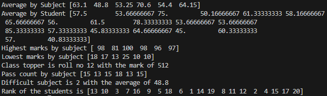

# Student Mark Analysis using NumPy

A beginner NumPy mini project for analyzing student marks using Python.

## Features

- Average marks by subject
- Average marks by student
- Highest & lowest marks
- Class topper detection
- Pass count per subject
- Difficult subject identification

## Concepts Used

- NumPy arrays
- Axis operations
- Mean, Sum, Max, Min
- Argmax & Argmin
- Boolean masking
- Matrix operations

## Technologies

- Python
- NumPy

## Output



## How to Run

```bash
pip install numpy
Student mark analysis.py
```
